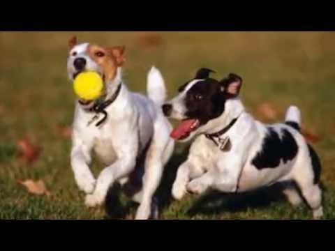

# CAPSTONE_PROJECT
CAPSTONE is an AI Image Captioning Predictor, it uses CNN-Resnet50 and LSTM for training on Flicker8k dataset of images to generate captions for them.

The Model contains:

1) Image model: for reducing image of high dimensions into selected features.
2) Language model: for creating output as embeddings to reduce complexity of model.
3) Final model: which will concatenate results of both this model and will use LSTM layer and Time Distributed layer for doing final_predicttions.
One of example of final prediction:

Two dogs running running white dog dog a brown dog the grass .
